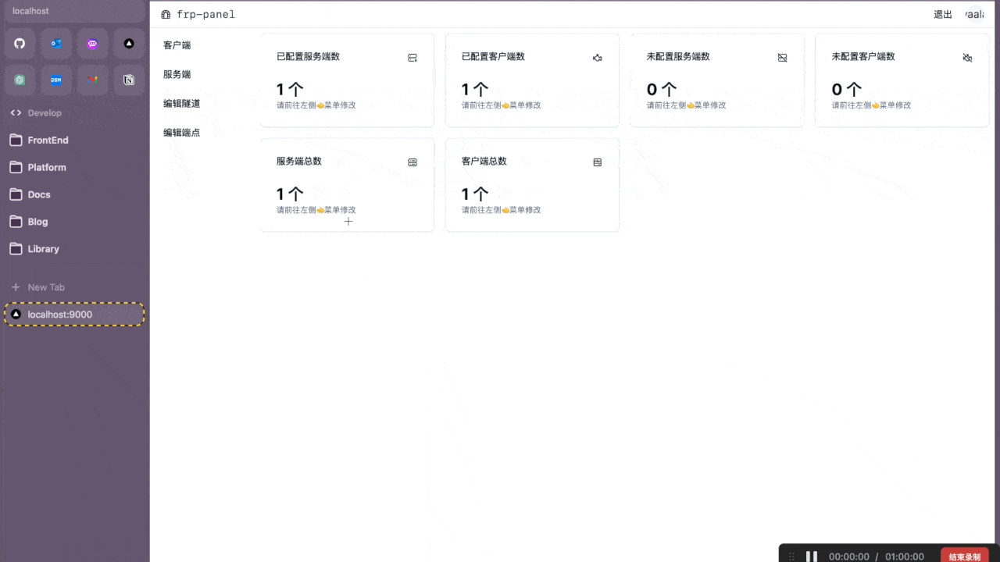
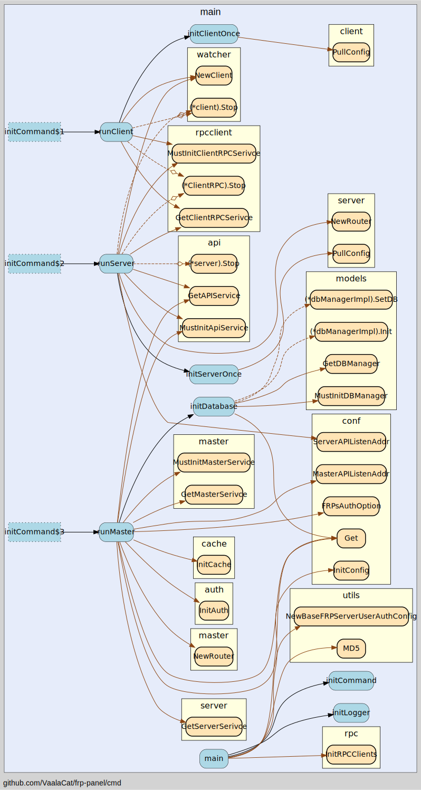
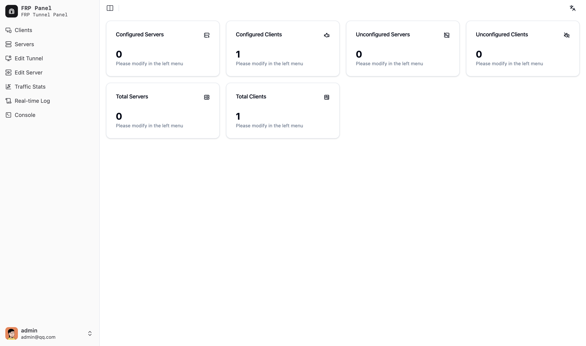
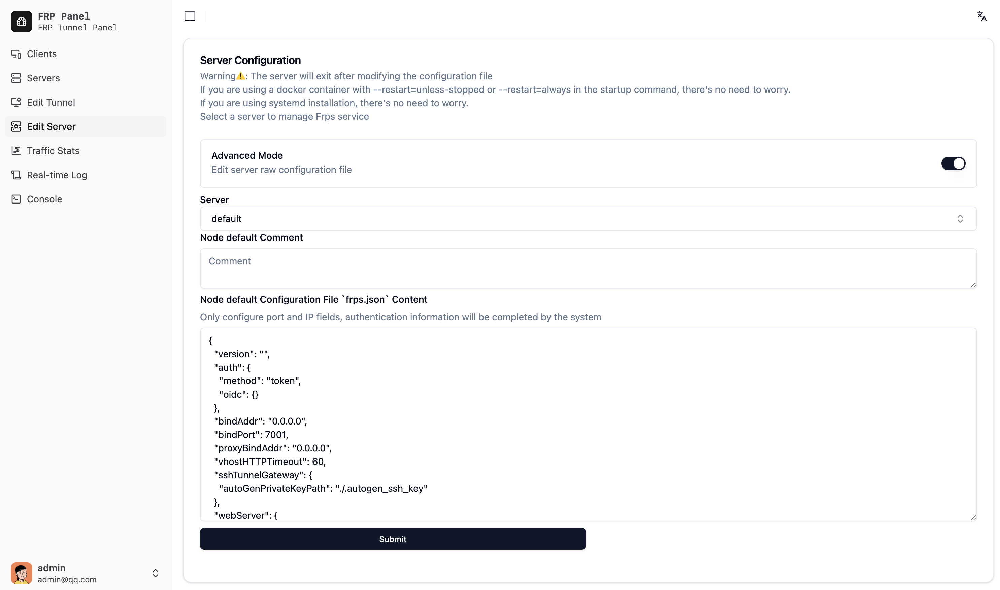
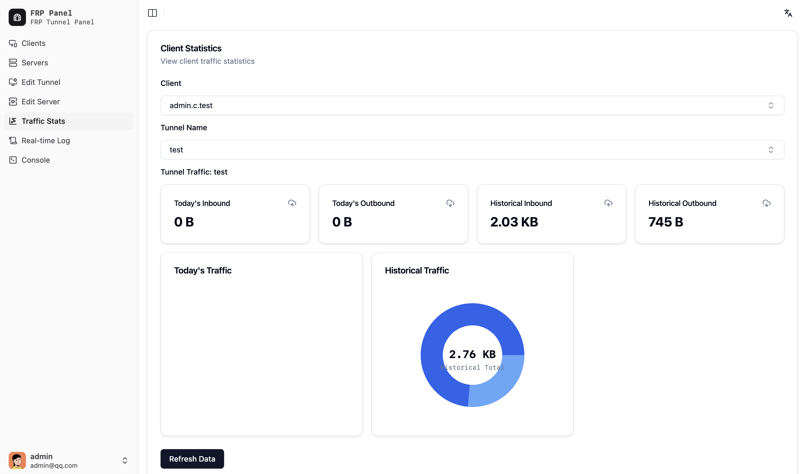

> FRP-Panel WIKI：[FRP-Panel WiKi](https://vaala.cat/frp-panel)
> Development blog: [https://vaala.cat/posts/frp-panel-doc/](https://vaala.cat/posts/frp-panel-doc/)
> You can refer to the wiki for instructions, or scroll down read simple doc.

# FRP-Panel

[English Version](README.md) | [中文文档](README_zh.md)

Our goal is to create a more powerful and comprehensive frp that provides:

- Centralized management of client configurations
- Management of multiple server configurations
- Visual configuration interface
- Simplified configuration required for running

<!-- - demo Video: [demo Video](docs/public/images/frp-panel-demo.mp4)

 -->

## Project Usage Instructions

frp-panel can be deployed in docker or direct run mode. For direct deployment, please download the files from the release: [release](https://github.com/VaalaCat/frp-panel/releases)

Note: There are two types of binaries, one is for the client only, and the other is a full-featured executable file. The client version will have a "client" identifier in its name.

After startup, the default access address is `http://IP:9000`.

The first registered user is the administrator by default. User registration is not open by default. If you need it, please add the following parameter to the Master startup command or configuration file: `APP_ENABLE_REGISTER=true`

After starting, there will be a "default" entry in the server list. If the status shows "Offline" in red, it indicates that your `MASTER_RPC_HOST` environment variable is not configured correctly or the port is not accessible externally. Please carefully check the configuration and redeploy.

To test if the port is open, run the following command on the server:

```shell
python3 -m http.server 8080
```

Then access in the browser: `http://IP:8080` (you can replace Port with any Port you want)

### Docker

Note⚠️: The startup commands for client and server may change as the project is updated. Although backward compatibility will be considered during project iterations, it is still difficult to fully adapt. Therefore, the startup commands for client and server should be generated from the master.

- master

Here's the translated guidance for running the Docker command:

```bash
# Recommended
# Change MASTER_RPC_HOST to the external IP of your server
# Be careful not to leak APP_GLOBAL_SECRET, it's generated by the Master for both the client and server
docker run -d \
	--network=host \
	--restart=unless-stopped \
	-v /opt/frp-panel:/data \
	-e APP_GLOBAL_SECRET=your_secret \
	-e MASTER_RPC_HOST=0.0.0.0 \
	vaalacat/frp-panel

# Alternatively
# Remember to remove comments when running the command
docker run -d -p 9000:9000 \ # API console port
	-p 9001:9001 \ # RPC port
	-p 7000:7000 \ # FRPS port
	-p 20000-20050:20000-20050 \ # Reserved ports for FRPS
	--restart=unless-stopped \
	-v /opt/frp-panel:/data \ # Data storage location
	-e APP_GLOBAL_SECRET=your_secret \ # Be careful not to leak the Master's secret, it's generated by the Master for both the client and server
	-e MASTER_RPC_HOST=0.0.0.0 \ # Change this to the external IP of your server
	vaalacat/frp-panel
```

- client

```bash
docker run -d \
    --network=host \
    --restart=unless-stopped \
    vaalacat/frp-panel client -s xxxx -i xxxx -a xxxx -r 127.0.0.1 -c 9001 -p 9000 -e http # Copy the parameters from the master WebUI
```

- server

```bash
docker run -d \
    --network=host \
    --restart=unless-stopped \
    vaalacat/frp-panel server -s xxxx -i xxxx -a xxxx -r 127.0.0.1 -c 9001 -p 9000 -e http # Copy the parameters from the master WebUI
```

### Direct Run (Linux)

- master

Note: Modify the IP

```bash
APP_GLOBAL_SECRET=your_secret MASTER_RPC_HOST=0.0.0.0 frp-panel master
```

- client

```bash
frp-panel client -s xxxx -i xxxx -a xxxx -r 127.0.0.1 -c 9001 -p 9000 -e http # Copy the parameters from the master WebUI
```

- server

```bash
frp-panel server -s xxxx -i xxxx -a xxxx -r 127.0.0.1 -c 9001 -p 9000 -e http # Copy the parameters from the master WebUI
```

### Direct Run (Windows)

In the same folder as the downloaded executable, create a `.env` file (note that there should be no file extension), then enter the following content and save it before running the corresponding command. Note that the corresponding parameters for client and server need to be copied from the web page.

- master: `frp-panel-amd64.exe master`

```
APP_GLOBAL_SECRET=your_secret
MASTER_RPC_HOST=IP
DB_DSN=data.db
```

For client and server, use the parameters copied from the master WebUI.

- client: `frp-panel-amd64.exe client -s xxxx -i xxxx -a xxxx -r 127.0.0.1 -c 9001 -p 9000 -e http # Copy the parameters from the master WebUI`

- server: `frp-panel-amd64.exe server -s xxxx -i xxxx -a xxxx -r 127.0.0.1 -c 9001 -p 9000 -e http # Copy the parameters from the master WebUI`

### Tunnel Advanced Mode Configuration

This panel is fully compatible with frp's original `json` format configuration. You only need to paste the configuration file content into the advanced mode editor for the server/client, and then update it. For detailed usage, please refer to: [frp documentation](https://gofrp.org/docs/features/common/configure/)

### Program Startup Configuration File

The program will read the contents of the following files in order as the configuration file: `.env`, `/etc/frpp/.env`

### Service Management

If you are using the installation script provided by the panel, systemd is used for Linux control, and frpp.exe is used for Windows control.

Examples of using Linux after installation:

```bash
systemctl stop frpp
systemctl start frpp
```

Examples of using Windows after installation:

```
C:/frpp/frpp.exe start
C:/frpp/frpp.exe stop
C:/frpp/frpp.exe uninstall
```

## Project Development Guide

### Platform Architecture Design

After choosing the tech stack, the next step is to design the program architecture. As mentioned in the background, frp itself has frpc and frps (client and server), these two roles are indispensable. Then we need to add something new to manage them, so frp-panel introduces a new master role. The master will be responsible for managing various frpc and frps, as well as centrally storing configuration files and connection information.

Next, we have frpc and frps. The original version requires writing configuration files on both sides. Since the original version already supports this, we don't need to follow the original approach. We will directly not support configuration files, and all configurations must be obtained from the master.

In addition, we also need to consider the compatibility with the original version. The client/server of frp-panel must be able to connect to the official frpc/frps service. In this way, both configuration file and non-configuration file modes can work perfectly.
Overall, the architecture is quite simple.


### Development

The project includes three roles:

1. Master: The control node, accepts requests from the frontend and is responsible for managing Client and Server.
2. Server: The server side, controlled by the control node, responsible for providing services to clients, including frps and rpc (for connecting to the Master) services.
3. Client: The client side, controlled by the control node, including frpc and rpc (for connecting to the Master) services.

Next, we will provide the functionality of each package in the project:

```
.
|-- biz                 # Main business logic
|   |-- client          # Client logic (here referring to the frp-panel client)
|   |-- master          # frp-panel control plane, responsible for handling frontend requests, and using rpc to manage frp-panel's server and client
|   |   |-- auth        # Authentication module, including user authentication and client authentication
|   |   |-- client      # Client module, including various APIs for the frontend to manage clients
|   |   |-- server      # Server module, including various APIs for the frontend to manage servers
|   |   `-- user        # User module, including user management, user information retrieval, etc.
|   `-- server          # Server logic
|-- cache               # Cache, used to store frps authentication tokens
|-- cmd                 # Command line entry, where the main function is located, responsible for starting various modules as needed
|-- common
|-- conf
|-- dao                 # Data access object, any operations related to the database will call this library
|-- doc                 # Documentation
|-- idl                 # IDL definitions
|-- middleware          # API middleware, including JWT and context-related, used to process API requests. After authentication passes, user information will be injected into the context and can be obtained through the common package.
|-- models              # Database models, used to define database tables. Also includes entity definitions.
|-- pb                  # Generated protobuf pb files
|-- rpc                 # Location of various rpcs, including the logic for Client/Server to call Master, as well as the logic for Master to use Stream to call Client and Server
|-- services            # Various modules that need to run persistently in memory, this package can manage the running/stopping of various services
|   |-- api             # API service, requires an external ginRouter to run
|   |-- client          # frp client, i.e., frpc, can control various configurations/start and stop of frpc
|   |-- master          # Master service, including the rpc server definition, after receiving an rpc request, it will call the biz package to handle the logic
|   |-- rpcclient       # Stateful rpc client, because the rpc clients don't have public IP addresses, the rpcclient will call the master's stream long-connection rpc when starting, and after the connection is established, the Master and Client communicate through this package
|   `-- server          # frp server, i.e., frps, can control various configurations/start and stop of frps
|-- tunnel              # Tunnel module, used to manage tunnels, i.e., manage frpc and frps services
|-- utils
|-- watcher             # Scheduled tasks, e.g., updating configuration files every 30 seconds
`-- www
    |-- api
    |-- components      # There is an apitest component here for testing
    |   `-- ui
    |-- lib
    |   `-- pb
    |-- pages
    |-- public
    |-- store
    |-- styles
    `-- types
```

### Debugging and Startup Methods:

- master: `go run cmd/*.go master`
  > For client and server, please copy the content from the master webui
- client: `go run cmd/*.go client -i <clientID> -s <clientSecret>`
- server: `go run cmd/*.go server -i <serverID> -s <serverSecret>`

The project configuration file will read the .env file in the current folder by default. The project includes a sample configuration file, which can be modified according to your needs.

Detailed architecture call diagram:



### Core Configuration Explanation

[settings.go](conf/settings.go)
This file contains detailed explanations of the configuration parameters. Please refer to this file if you need to further modify the configuration.

## Screenshots

### Index Page


### Server List


### Server Edit


### Server Edit Advanced


### Client List


### Client Edit


### Client Edit Advanced


### Client Stats


### Realtime Log


### Remote Console

