> 详细博客地址: [https://vaala.cat/2024/01/14/frp-panel-doc/](https://vaala.cat/2024/01/14/frp-panel-doc/)
> 使用说明可以看博客，也可以直接滑到最后

# FRP-Panel

我们的目标就是做一个：   
- 客户端配置可中心化管理   
- 多服务端配置管理   
- 可视化配置界面   
- 简化运行所需要的配置   
   
的更强更完善的frp！

- demo Video: [demo Video](doc/frp-panel-demo.mp4)

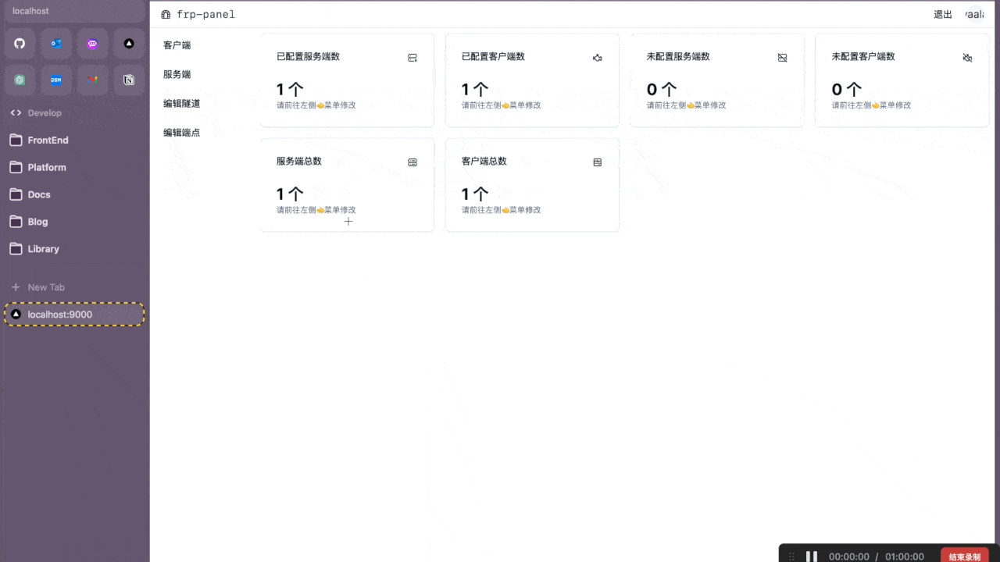

## 项目开发指南

### 平台架构设计   

技术栈选好了，下一步就是要设计程序的架构。在刚刚背景里说的那样，frp本身有frpc和frps（客户端和服务端），这两个角色肯定是必不可少了。然后我们还要新增一个东西去管理它们，所以frp-panel新增了一个master角色。master会负责管理各种frpc和frps，中心化的存储配置文件和连接信息。   

然后是frpc和frps。原版是需要在两边分别写配置文件的。那么既然原版已经支持了，就不用在走原版的路子，我们直接不支持配置文件，所有的配置都必须从master获取。   

其次还要考虑到与原版的兼容问题，frp-panel的客户端/服务端都必须要能连上官方frpc/frps服务。这样的话就可以做到配置文件/不要配置文件都能完美工作了。   
总的说来架构还是很简单的。

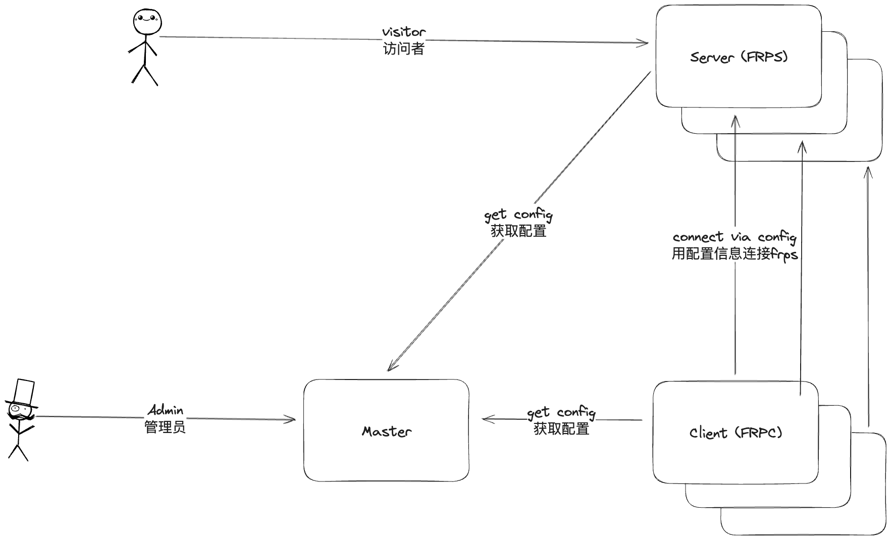

### 开发

项目包含三个角色   
1. Master: 控制节点，接受来自前端的请求并负责管理Client和Server   
2. Server: 服务端，受控制节点控制，负责对客户端提供服务，包含frps和rpc(用于连接Master)服务   
3. Client: 客户端，受控制节点控制，包含frpc和rpc(用于连接Master)服务   
   
接下来给出一个项目中各个包的功能   
```
.
|-- biz                 # 主要业务逻辑
|   |-- client          # 客户端逻辑（这里指的是frp-panel的客户端）
|   |-- master          # frp-panel 控制平面，负责处理前端请求，并且使用rpc管理frp-panel的server和client
|   |   |-- auth        # 认证模块，包含用户认证和客户端认证
|   |   |-- client      # 客户端模块，包含前端管理客户端的各种API
|   |   |-- server      # 服务端模块，包含前端管理服务端的各种API
|   |   `-- user        # 用户模块，包含用户管理、用户信息获取等
|   `-- server          # 服务端逻辑（这里指的是frp-panel的服务端）
|-- cache               # 缓存，用于存储frps的认证token
|-- cmd                 # 命令行入口，main函数的所在地，负责按需启动各个模块
|-- common
|-- conf
|-- dao                 # data access object，任何和数据库相关的操作会调用这个库
|-- doc                 # 文档
|-- idl                 # idl定义
|-- middleware          # api的中间件，包含JWT和context相关，用于处理api请求，鉴权通过后会把用户信息注入到context，可以通过common包获取
|-- models              # 数据库模型，用于定义数据库表。同时包含实体定义
|-- pb                  # protobuf生成的pb文件
|-- rpc                 # 各种rpc的所在地，包含Client/Server调用Master的逻辑，也包含Master使用Stream调用Client和Server的逻辑
|-- services            # 各种需要在内存中持久运行的模块，这个包可以管理各个服务的运行/停止
|   |-- api             # api服务，运行需要外部传入一个ginRouter
|   |-- client          # frp的客户端，即frpc，可以控制frpc的各种配置/开始与停止
|   |-- master          # master服务，包含rpc的服务端定义，接收到rpc请求后会调用biz包处理逻辑
|   |-- rpcclient       # 有状态的rpc客户端，因为rpc的client都没有公网ip，因此在rpc client启动时会调用master的stream长连接rpc，建立连接后Master和Client通过这个包通信
|   `-- server          # frp的服务端，即frps，可以控制frps的各种配置/开始与停止
|-- tunnel              # tunnel模块，用于管理tunnel，也就是管理frpc和frps服务
|-- utils
|-- watcher             # 定时运行的任务，比如每30秒更新一次配置文件
`-- www
    |-- api
    |-- components # 这里面有一个apitest组件用于测试
    |   `-- ui
    |-- lib
    |   `-- pb
    |-- pages
    |-- public
    |-- store
    |-- styles
    `-- types

```

### 调试启动方式：

- master: `go run cmd/*.go master`
> client 和 server 的具体参数请复制 master webui 中的内容
- client: `go run cmd/*.go client -i <clientID> -s <clientSecret>`
- server: `go run cmd/*.go server -i <serverID> -s <serverSecret>`

项目配置文件会默认读取当前文件夹下的.env文件，项目内置了样例配置文件，可以按照自己的需求进行修改

详细架构调用图


## 项目使用说明
frp-panel可选docker和直接运行模式部署，直接部署请到release下载文件：[release](https://github.com/VaalaCat/frp-panel/releases)

注意：二进制有两种，一种是仅客户端，一种是全功能可执行文件，客户端版只能执行client命令

启动过后默认访问地址为 http://IP:9000

### docker   

注意⚠️：client 和 server 的启动指令可能会随着项目更新而改变，虽然在项目迭代时会注意前后兼容，但仍难以完全适配，因此 client 和 server 的启动指令以 master 生成为准

- master   
   
```bash
docker run -d -p 9000:9000 \ # API控制台端口
	-p 9001:9001 \ # rpc端口
	-p 7000:7000 \ # frps 端口
	-p 20000-20050:20000-20050 \ # 给frps预留的端口
    --restart=unless-stopped \
	-v /opt/frp-panel:/data \ # 数据存储位置
	-e APP_GLOBAL_SECRET=your_secret \ # Master的secret注意不要泄漏，客户端和服务端的是通过Master生成的
	-e MASTER_RPC_HOST=0.0.0.0 \ # 这里要改成你服务器的外部IP
	vaalacat/frp-panel
# 或者
docker run -d \
	--network=host \
    --restart=unless-stopped \
	-v /opt/frp-panel:/data \
	-e APP_GLOBAL_SECRET=your_secret \ # Master的secret注意不要泄漏，客户端和服务端的是通过Master生成的
	-e MASTER_RPC_HOST=0.0.0.0 \ # 这里要改成你服务器的外部IP
	vaalacat/frp-panel
```
- client   
   
```bash
docker run -d \
	--network=host \
    --restart=unless-stopped \
	vaalacat/frp-panel client -s xxxx -i xxxx -a xxxx -r 127.0.0.1 -c 9001 -p 9000 -e http # 在master WebUI复制的参数
```
- server   
   
```bash
docker run -d \
	--network=host \
    --restart=unless-stopped \
	vaalacat/frp-panel server -s xxxx -i xxxx -a xxxx -r 127.0.0.1 -c 9001 -p 9000 -e http # 在master WebUI复制的参数
```

### 直接运行(Linux)
- master   

注意修改IP
```
APP_GLOBAL_SECRET=your_secret MASTER_RPC_HOST=0.0.0.0 frp-panel master
```
- client
   
```
frp-panel client -s xxxx -i xxxx -a xxxx -r 127.0.0.1 -c 9001 -p 9000 -e http # 在master WebUI复制的参数
```
- server
   
```
frp-panel server -s xxxx -i xxxx -a xxxx -r 127.0.0.1 -c 9001 -p 9000 -e http # 在master WebUI复制的参数
```
### 直接运行(Windows)
在下载的可执行文件同名文件夹下创建一个 `.env` 文件(注意不要有后缀名)，然后输入以下内容保存后运行对应命令，注意，client和server的对应参数需要在web页面复制

- master: `frp-panel-amd64.exe master`
```
APP_GLOBAL_SECRET=your_secret
MASTER_RPC_HOST=IP
DB_DSN=data.db
```

client 和 server 要使用在 master WebUI复制的参数

- client: `frp-panel-amd64.exe client -s xxxx -i xxxx -a xxxx -r 127.0.0.1 -c 9001 -p 9000 -e http # 在master WebUI复制的参数`

- server: `frp-panel-amd64.exe server -s xxxx -i xxxx -a xxxx -r 127.0.0.1 -c 9001 -p 9000 -e http # 在master WebUI复制的参数`

### 配置说明

[settings.go](conf/settings.go)
这里有详细的配置参数解释，需要进一步修改配置请参考该文件

### 一些图片

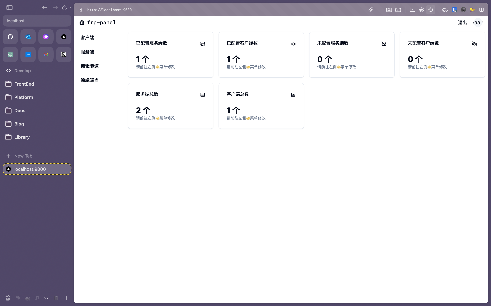
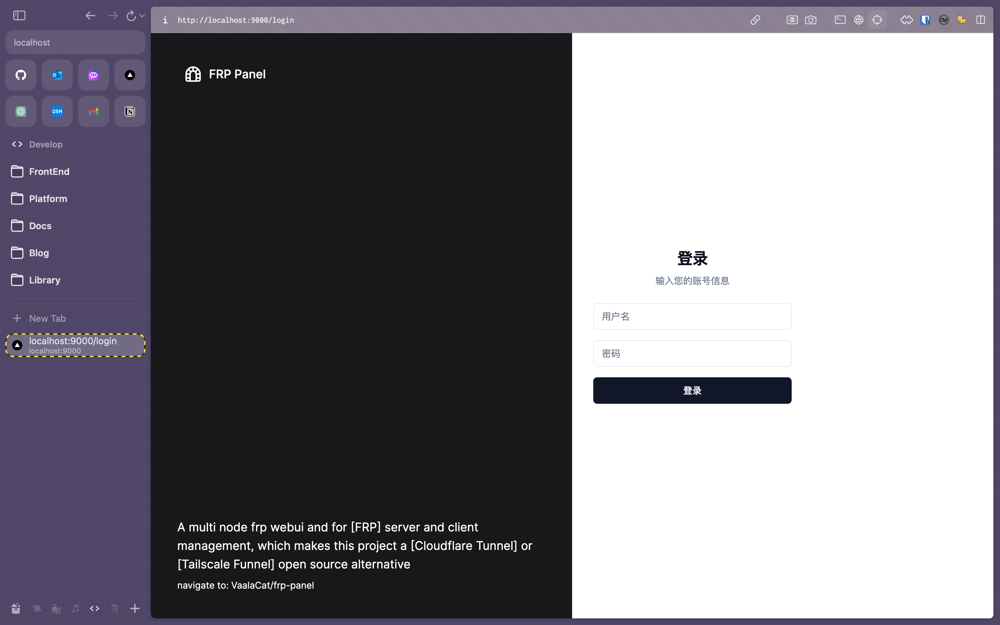

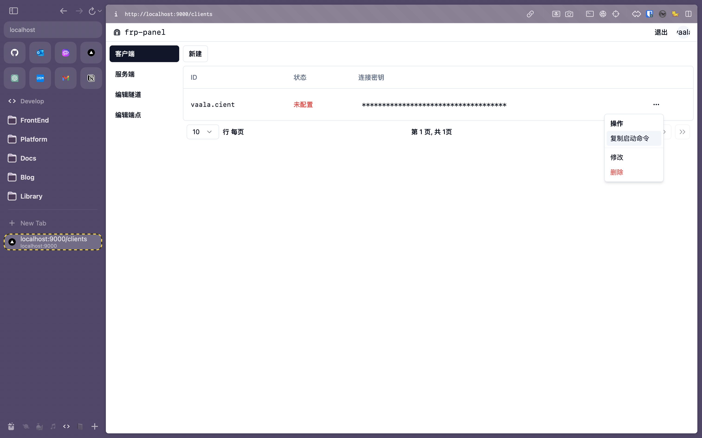
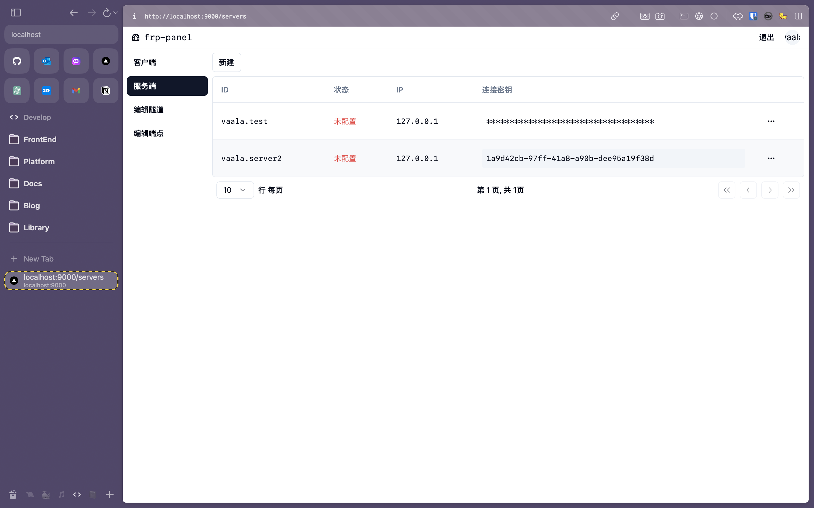
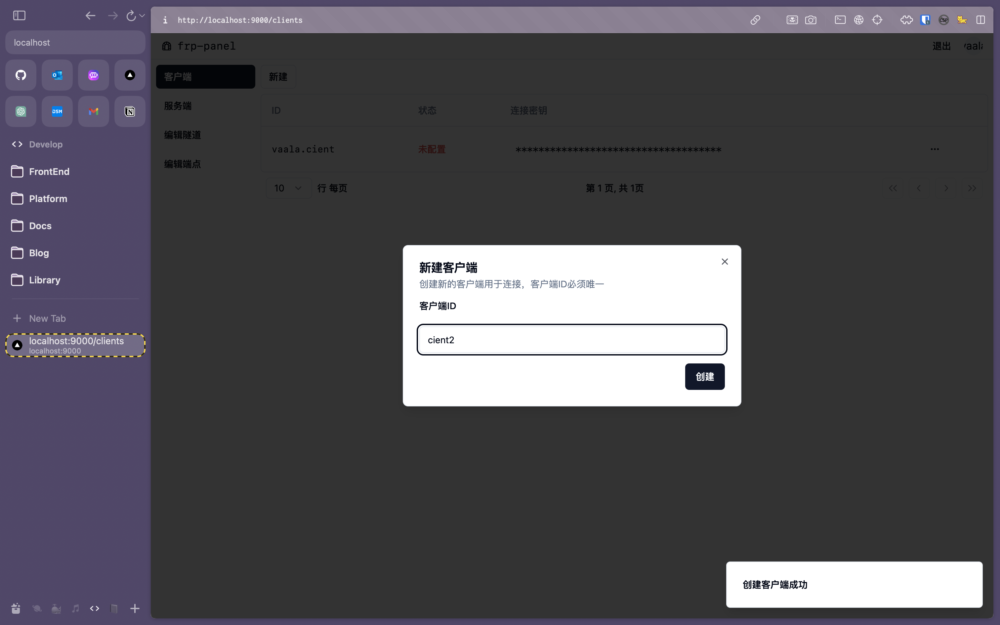
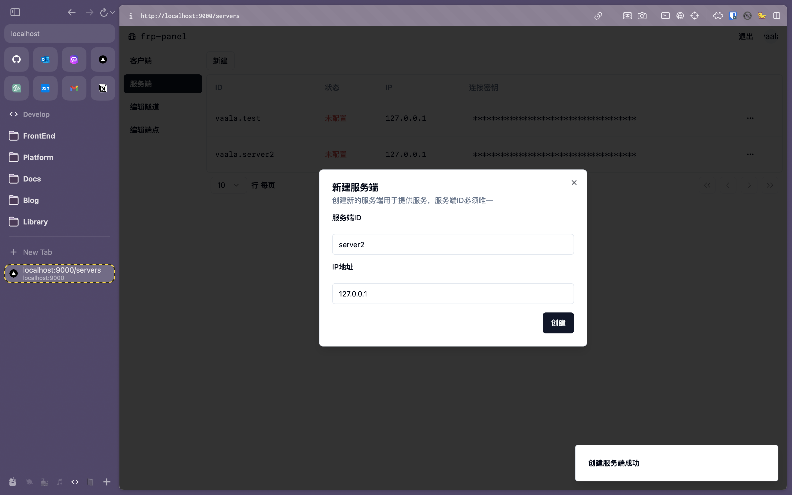
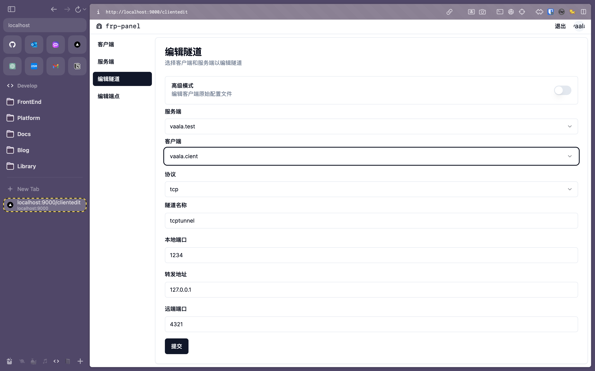
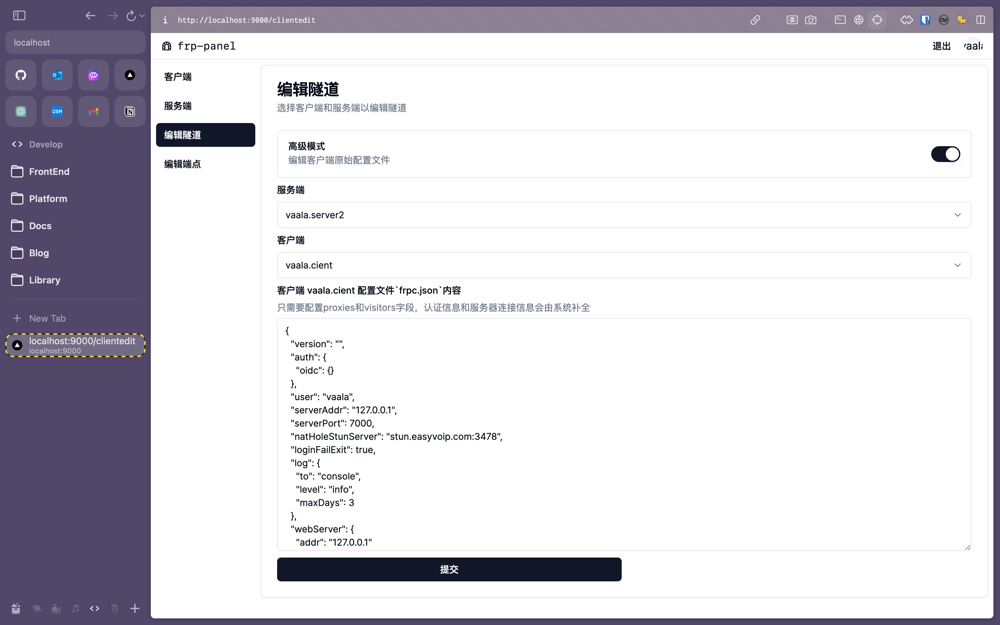
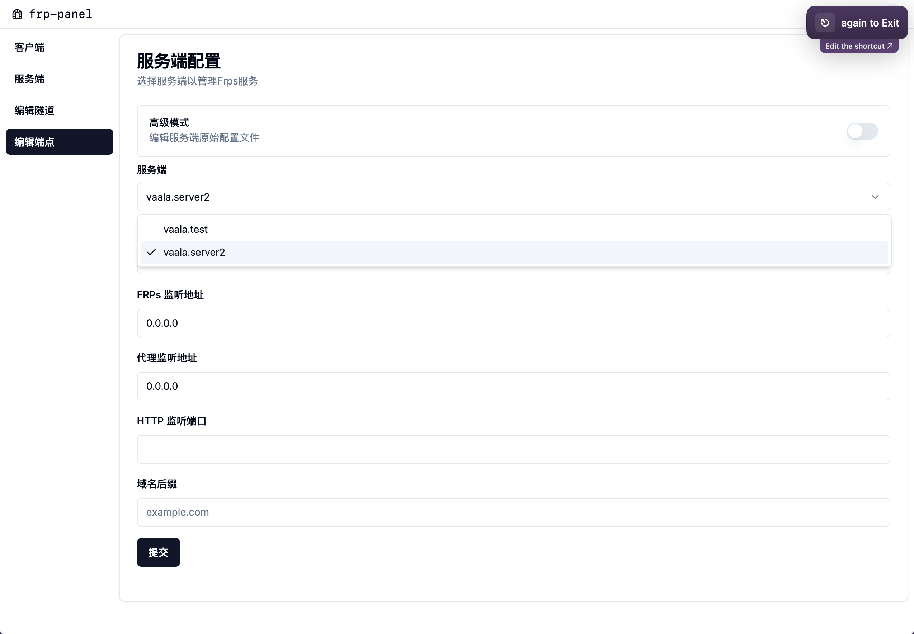
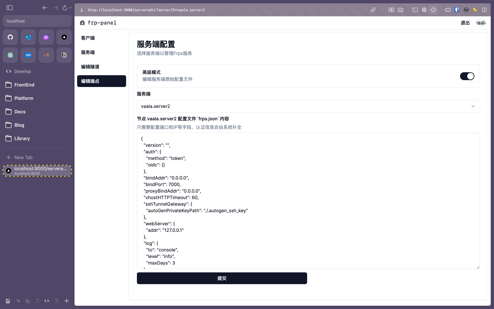