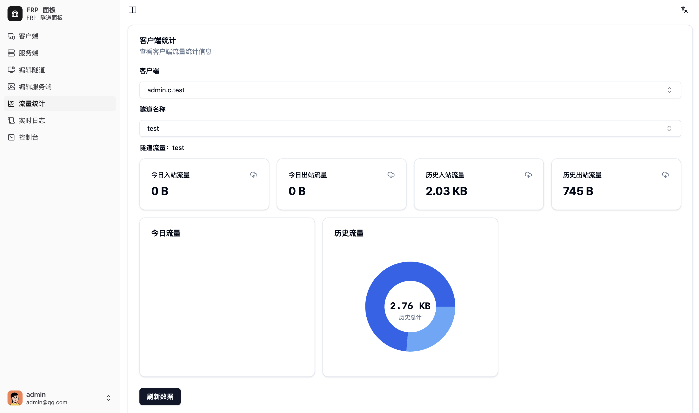

> 详细使用文档：[FRP-Panel WiKi](https://vaala.cat/frp-panel)
>
> 博客开发记录: [https://vaala.cat/posts/frp-panel-doc/](https://vaala.cat/posts/frp-panel-doc/)

QQ交流群: 830620423

# FRP-Panel

[English Version](README.md) | [中文文档](README_zh.md)

<a href="https://trendshift.io/repositories/7147" target="_blank"></a>

我们的目标就是做一个：

- 客户端配置可中心化管理
- 多服务端配置管理
- 可视化配置界面
- 简化运行所需要的配置
- 支持Cloudflare边缘计算Worker

的更强更完善的 frp！

- demo Video: [demo Video](./docs/public/images/frp-panel-demo.mp4)


## 项目使用说明

frp-panel 可选 docker 和直接运行模式部署，直接部署请到 release 下载文件：[release](https://github.com/VaalaCat/frp-panel/releases)

注意：二进制有两种，一种是仅客户端，一种是全功能可执行文件，客户端版只能执行 client 命令(无需 client 参数)

客户端版的名字会带有 client 标识

启动过后默认访问地址为 `http://IP:9000`

默认第一个注册的用户是管理员。且默认不开放注册多用户，如果需要，请在 Master 启动命令或配置文件中添加参数：`APP_ENABLE_REGISTER=true`

启动后在服务端列表中会有一个default，如果运行信息为“不在线”且为红色，则说明您的 `MASTER_RPC_HOST` 启动环境变量没有配置正确或端口外部访问不成功，请仔细检查配置重新部署。

测试端口是否开放的方法，在服务器上运行：

```shell
python3 -m http.server 8080
```

然后在浏览器中访问：`http://IP:8080` (端口可以换成任意你想测试的端口)，访问成功则为端口开放

程序的默认存储数据路径和程序文件同目录，如需修改请参考下方的配置表格

## Star History

[](https://www.star-history.com/#vaalacat/frp-panel&Date)

### docker

注意 ⚠️：client 和 server 的启动指令可能会随着项目更新而改变，虽然在项目迭代时会注意前后兼容，但仍难以完全适配，因此 client 和 server 的启动指令以 master 生成为准

- master

```bash
# 推荐
# MASTER_RPC_HOST要改成你服务器的外部IP
# APP_GLOBAL_SECRET注意不要泄漏，客户端和服务端的是通过Master生成的
docker run -d \
	--network=host \
	--restart=unless-stopped \
	-v /opt/frp-panel:/data \
	-e APP_GLOBAL_SECRET=your_secret \
	-e MASTER_RPC_HOST=0.0.0.0 \
	vaalacat/frp-panel
# 或者
# 运行时记得删除命令中的中文
docker run -d -p 9000:9000 \ # API控制台端口
	-p 9001:9001 \ # rpc端口
	-p 7000:7000 \ # frps 端口
	-p 20000-20050:20000-20050 \ # 给frps预留的端口
	--restart=unless-stopped \
	-v /opt/frp-panel:/data \ # 数据存储位置
	-e APP_GLOBAL_SECRET=your_secret \ # Master的secret注意不要泄漏，客户端和服务端的是通过Master生成的
	-e MASTER_RPC_HOST=0.0.0.0 \ # 这里要改成你服务器的外部IP
	vaalacat/frp-panel
```

- client

```bash
docker run -d \
	--network=host \
	--restart=unless-stopped \
	vaalacat/frp-panel client -s xxxx -i xxxx -a xxxx -r 127.0.0.1 -c 9001 -p 9000 -e http # 在master WebUI复制的参数
```

- server

```bash
docker run -d \
	--network=host \
	--restart=unless-stopped \
	vaalacat/frp-panel server -s xxxx -i xxxx -a xxxx -r 127.0.0.1 -c 9001 -p 9000 -e http # 在master WebUI复制的参数
```

### 直接运行(Linux)

- master

注意修改 IP

```bash
APP_GLOBAL_SECRET=your_secret MASTER_RPC_HOST=0.0.0.0 frp-panel master
```

- client

```bash
frp-panel client -s xxxx -i xxxx -a xxxx -r 127.0.0.1 -c 9001 -p 9000 -e http # 在master WebUI复制的参数
```

- server

```bash
frp-panel server -s xxxx -i xxxx -a xxxx -r 127.0.0.1 -c 9001 -p 9000 -e http # 在master WebUI复制的参数
```

### 直接运行(Windows)

在下载的可执行文件同名文件夹下创建一个 `.env` 文件(注意不要有后缀名)，然后输入以下内容保存后运行对应命令，注意，client 和 server 的对应参数需要在 web 页面复制

```
APP_GLOBAL_SECRET=your_secret
MASTER_RPC_HOST=IP
DB_DSN=data.db
```

- master: `frp-panel-amd64.exe master`

client 和 server 要使用在 master WebUI 复制的参数

- client: `frp-panel-amd64.exe client -s xxxx -i xxxx -a xxxx -r 127.0.0.1 -c 9001 -p 9000 -e http # 在master WebUI复制的参数`

- server: `frp-panel-amd64.exe server -s xxxx -i xxxx -a xxxx -r 127.0.0.1 -c 9001 -p 9000 -e http # 在master WebUI复制的参数`

### 隧道高级模式配置

本面板完全兼容 frp 原本的`json`格式配置，仅需要将配置文件内容粘贴到服务端/客户端高级模式编辑框内，更新即可，详细的使用参考：[frp 文档](https://gofrp.org/zh-cn/docs/features/common/configure/)

### 程序启动配置文件

程序会按顺序读取以下文件内容作为配置文件：`.env`,`/etc/frpp/.env`

### 服务管理

如果您使用的是面板自带的安装脚本，对于 Linux 使用 systemd 控制，对于 Windows 使用 本程序 控制

Linux 安装后使用示例：

```bash
systemctl stop frpp
systemctl start frpp
```

Windows 安装后使用示例：

```
C:/frpp/frpp.exe stop
C:/frpp/frpp.exe start
C:/frpp/frpp.exe uninstall
```

### 配置说明

| 类型   | 环境变量名                             | 默认值               | 描述                                                             |
|--------|-------------------------------------|--------------------|----------------------------------------------------------------|
| string | `APP_SECRET`                       | -                  | 应用密钥，用于客户端和服务器的和Master的通信加密                        |
| string | `APP_GLOBAL_SECRET`                | `frp-panel`        | 全局密钥，用于管理生成密钥，需妥善保管                                 |
| int    | `APP_COOKIE_AGE`                   | `86400`            | Cookie 的有效期（秒），默认值为 1 天                                  |
| string | `APP_COOKIE_NAME`                  | `frp-panel-cookie` | Cookie 名称                                                        |
| string | `APP_COOKIE_PATH`                  | `/`                | Cookie 路径                                                       |
| string | `APP_COOKIE_DOMAIN`                | -                  | Cookie 域                                                         |
| bool   | `APP_COOKIE_SECURE`                | `false`            | Cookie 是否安全                                                   |
| bool   | `APP_COOKIE_HTTP_ONLY`             | `true`             | Cookie 是否仅限 HTTP                                             |
| bool   | `APP_ENABLE_REGISTER`              | `false`            | 是否启用注册，仅允许第一个管理员注册                               |
| int    | `MASTER_API_PORT`                  | `9000`             | 主节点 API 端口                                                  |
| string | `MASTER_API_HOST`                  | -                  | 主节点域名，可以在反向代理和CDN后                                 |
| string | `MASTER_API_SCHEME`                | `http`             | 主节点 API 协议（注意，这里不影响主机行为，设置为https只是为了方便复制客户端启动命令，HTTPS需要自行反向代理）|
| int    | `MASTER_CACHE_SIZE`                | `10`               | 缓存大小（MB）                                                   |
| string | `MASTER_RPC_HOST`                  | `127.0.0.1`        | Master节点公共 IP 或域名                                          |
| int    | `MASTER_RPC_PORT`                  | `9001`             | Master节点 RPC 端口                                            |
| bool   | `MASTER_COMPATIBLE_MODE`           | `false`            | 兼容模式，用于官方 frp 客户端                                     |
| string | `MASTER_INTERNAL_FRP_SERVER_HOST`  | -                  | Master内置 frps 服务器主机，用于客户端连接                                |
| int    | `MASTER_INTERNAL_FRP_SERVER_PORT`  | `9002`             | Master内置 frps 服务器端口，用于客户端连接                                |
| string | `MASTER_INTERNAL_FRP_AUTH_SERVER_HOST` | `127.0.0.1`    | Master内置 frps 认证服务器主机                                          |
| int    | `MASTER_INTERNAL_FRP_AUTH_SERVER_PORT` | `8999`          | Master内置 frps 认证服务器端口                                          |
| string | `MASTER_INTERNAL_FRP_AUTH_SERVER_PATH` | `/auth`         | Master内置 frps 认证服务器路径                                          |
| int    | `SERVER_API_PORT`                  | `8999`             | 服务器 API 端口                                                  |
| string | `DB_TYPE`                          | `sqlite3`         | 数据库类型，如 mysql postgres 或 sqlite3 等                                 |
| string | `DB_DSN`                           | `data.db`         | 数据库 DSN，默认使用sqlite3，数据默认存储在可执行文件同目录下，对于 sqlite 是路径，其他数据库为 DSN，参见 [MySQL DSN](https://github.com/go-sql-driver/mysql#dsn-data-source-name) |
| string | `CLIENT_ID`                        | -                  | 客户端 ID                                                        |
| string | `CLIENT_SECRET`                   | -                  | 客户端密钥                                                       |

## 项目开发指南

### 平台架构设计

技术栈选好了，下一步就是要设计程序的架构。在刚刚背景里说的那样，frp 本身有 frpc 和 frps（客户端和服务端），这两个角色肯定是必不可少了。然后我们还要新增一个东西去管理它们，所以 frp-panel 新增了一个 master 角色。master 会负责管理各种 frpc 和 frps，中心化的存储配置文件和连接信息。

然后是 frpc 和 frps。原版是需要在两边分别写配置文件的。那么既然原版已经支持了，就不用在走原版的路子，我们直接不支持配置文件，所有的配置都必须从 master 获取。

其次还要考虑到与原版的兼容问题，frp-panel 的客户端/服务端都必须要能连上官方 frpc/frps 服务。这样的话就可以做到配置文件/不要配置文件都能完美工作了。
总的说来架构还是很简单的。


### 开发

项目包含三个角色

1. Master: 控制节点，接受来自前端的请求并负责管理 Client 和 Server
2. Server: 服务端，受控制节点控制，负责对客户端提供服务，包含 frps 和 rpc(用于连接 Master)服务
3. Client: 客户端，受控制节点控制，包含 frpc 和 rpc(用于连接 Master)服务

接下来给出一个项目中各个包的功能

```
.
|-- biz                 # 主要业务逻辑
|   |-- client          # 客户端逻辑（这里指的是frp-panel的客户端）
|   |-- master          # frp-panel 控制平面，负责处理前端请求，并且使用rpc管理frp-panel的server和client
|   |   |-- auth        # 认证模块，包含用户认证和客户端认证
|   |   |-- client      # 客户端模块，包含前端管理客户端的各种API
|   |   |-- server      # 服务端模块，包含前端管理服务端的各种API
|   |   `-- user        # 用户模块，包含用户管理、用户信息获取等
|   `-- server          # 服务端逻辑（这里指的是frp-panel的服务端）
|-- cache               # 缓存，用于存储frps的认证token
|-- cmd                 # 命令行入口，main函数的所在地，负责按需启动各个模块
|-- common
|-- conf
|-- dao                 # data access object，任何和数据库相关的操作会调用这个库
|-- doc                 # 文档
|-- idl                 # idl定义
|-- middleware          # api的中间件，包含JWT和context相关，用于处理api请求，鉴权通过后会把用户信息注入到context，可以通过common包获取
|-- models              # 数据库模型，用于定义数据库表。同时包含实体定义
|-- pb                  # protobuf生成的pb文件
|-- rpc                 # 各种rpc的所在地，包含Client/Server调用Master的逻辑，也包含Master使用Stream调用Client和Server的逻辑
|-- services            # 各种需要在内存中持久运行的模块，这个包可以管理各个服务的运行/停止
|   |-- api             # api服务，运行需要外部传入一个ginRouter
|   |-- client          # frp的客户端，即frpc，可以控制frpc的各种配置/开始与停止
|   |-- master          # master服务，包含rpc的服务端定义，接收到rpc请求后会调用biz包处理逻辑
|   |-- rpcclient       # 有状态的rpc客户端，因为rpc的client都没有公网ip，因此在rpc client启动时会调用master的stream长连接rpc，建立连接后Master和Client通过这个包通信
|   `-- server          # frp的服务端，即frps，可以控制frps的各种配置/开始与停止
|-- tunnel              # tunnel模块，用于管理tunnel，也就是管理frpc和frps服务
|-- utils
|-- watcher             # 定时运行的任务，比如每30秒更新一次配置文件
`-- www
    |-- api
    |-- components # 这里面有一个apitest组件用于测试
    |   `-- ui
    |-- lib
    |   `-- pb
    |-- pages
    |-- public
    |-- store
    |-- styles
    `-- types

```

### 调试启动方式：

- master: `go run cmd/*.go master`
  > client 和 server 的具体参数请复制 master webui 中的内容
- client: `go run cmd/*.go client -i <clientID> -s <clientSecret>`
- server: `go run cmd/*.go server -i <serverID> -s <serverSecret>`

项目配置文件会默认读取当前文件夹下的.env 文件，项目内置了样例配置文件，可以按照自己的需求进行修改

详细架构调用图


### 本体配置说明

[settings.go](conf/settings.go)
这里有详细的配置参数解释，需要进一步修改配置请参考该文件

## 截图展示

### 首页


### 服务器列表


### 服务器编辑


### 服务器高级编辑


### 客户端列表


### 客户端编辑


### 客户端高级编辑


### 客户端统计


### 实时日志


### 远程控制台

