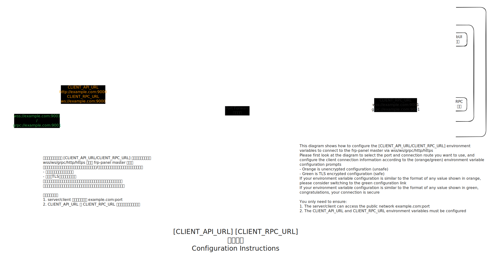

# Master Deployment

Master is recommended to be deployed using docker! Direct installation on the server is not recommended.

Three deployment methods will be provided, choose any one of them.

After deployment, there is no default user. The first registered user will be the administrator. For security reasons, multi-user registration is disabled by default.

## Preparation

### Open public network ports on the server:

- **WEBUI port**: Default `TCP 9000`
- **RPC port**: Default `TCP 9001`
- **frps API port**: No default, please reserve as needed, example uses `TCP/UDP 7000`
- **frps public service ports**: No default, please reserve as needed, example uses `TCP/UDP 26999-27050`

If using a reverse proxy, ignore the WEBUI and RPC ports, and open ports 80/443 instead.

The WEBUI port can also handle h2c format RPC connections.

The RPC port can also handle self-signed HTTPS API connections.

Both can use a reverse proxy server for connection and TLS provision.

If you want to use a safe method, please refer to the figure below to set the environment variables "`CLIENT_RPC_URL` and `CLIENT_API_URL`".

Note⚠️: Please deploy successfully using the normal deployment method first! Then adjust these two variables! ! ! !

Orange is unsafe, green is safe. You need to ensure that both environment variables are set to work properly



> Method to test if a port is open (using 8080 as an example), run on the server:
> ```shell
> python3 -m http.server 8080
> ```
> Then execute on another computer/server:
> ```shell
> curl http://server-public-IP/domain:8080 -I
> ```
> If successful, the output will be similar to:
> ```
> HTTP/1.0 200 OK
> Server: SimpleHTTP/0.6 Python/3.11.0
> Date: Sat, 12 Apr 2025 17:12:15 GMT
> Content-type: text/html; charset=utf-8
> Content-Length: 8225
> ```

## Method 1: Docker Compose Deployment

The server needs to have docker and docker compose installed.

First, create a `docker-compose.yaml` file with the following content:

```yaml
version: "3"

services:
  frpp-master:
    image: vaalacat/frp-panel:latest
    network_mode: host
    environment:
      APP_GLOBAL_SECRET: your_secret
      MASTER_RPC_HOST: 1.2.3.4 #Server's external IP or domain name
      MASTER_RPC_PORT: 9001
      MASTER_API_HOST: 1.2.3.4 #Server's external IP or domain name
      MASTER_API_PORT: 9000
      MASTER_API_SCHEME: http
    volumes:
      - ./data:/data
    restart: unless-stopped
    command: master
```

## Method 2: Docker Command Deployment

The server needs to have docker installed. We recommend deploying `Master` using host network mode.

```bash
# Recommended
# Change MASTER_RPC_HOST to your server's external IP
# Be careful not to leak APP_GLOBAL_SECRET, client and server are generated through Master
docker run -d \
	--network=host \
	--restart=unless-stopped \
	-v /opt/frp-panel:/data \
	-e APP_GLOBAL_SECRET=your_secret \
	-e MASTER_RPC_HOST=0.0.0.0 \
	vaalacat/frp-panel
```

If you don't want to use host network mode, please refer to the modified command below:

```bash
# Or
# Remember to delete the Chinese comments in the command when running
docker run -d -p 9000:9000 \ # API console port
	-p 9001:9001 \ # rpc port
	-p 7000:7000 \ # frps port
	-p 27000-27050:27000-27050 \ # reserved ports for frps
	--restart=unless-stopped \
	-v /opt/frp-panel:/data \ # data storage location
	-e APP_GLOBAL_SECRET=your_secret \ # Be careful not to leak Master's secret, client and server are generated through Master
	-e MASTER_RPC_HOST=0.0.0.0 \ # Change this to your server's external IP
	vaalacat/frp-panel
```

## Method 3: Deployment with Docker Reverse Proxy TLS Encryption

Here we use [Traefik](https://traefik.io/traefik/) as an example.

> `Traefik` can automatically identify Docker container ports in real-time and hot update configurations, making it very suitable for Docker service reverse proxying.

First, create a dedicated network for the reverse proxy named `traefik`.
```bash
docker network create traefik
```
Then start the reverse proxy and Master service:
- `docker-compose.yaml`

```yaml
version: '3'

services:
  traefk-reverse-proxy:
    image: traefik:v3.3
    restart: unless-stopped
    networks:
      - traefik
    command:
      - --entryPoints.web.address=:80
      - --entryPoints.websecure.address=:443
	  - --entryPoints.websecure.http2.maxConcurrentStreams=250
      - --providers.docker
      - --providers.docker.network=traefik
      - --api.insecure # Delete this line in production environment
	  # Below uses port 80 for ACME HTTP DNS certificate validation
      - --certificatesresolvers.le.acme.email=me@example.com
      - --certificatesresolvers.le.acme.storage=/etc/traefik/conf/acme.json
      - --certificatesresolvers.le.acme.httpchallenge=true
    ports:
      # Reverse proxy HTTP port
      - "80:80"
	  # Reverse proxy HTTPS port
	  - "443:443"
      # Traefik Web UI (--api.insecure=true will use this port)
	  # Delete this port in production environment
      - "8080:8080"
    volumes:
      # Mount docker.sock so Traefik can automatically identify all docker container reverse proxy configurations on the host
      - /var/run/docker.sock:/var/run/docker.sock
	  # Save certificates requested by Traefik
	  - ./conf:/etc/traefik/conf

  frpp-master:
    image: vaalacat/frp-panel:latest # Change to the version you want to use
    environment:
      APP_GLOBAL_SECRET: your_secret
	# Because api and rpc use different protocols
	# We need to use two domains for api and rpc
	# So the reverse proxy can correctly identify the protocol to forward
      MASTER_RPC_HOST: frpp.example.com
      MASTER_API_PORT: 443
      MASTER_API_HOST: frpp-rpc.example.com
      MASTER_API_SCHEME: https
    networks:
      - traefik
    volumes:
      - ./data:/data
    ports:
	  # No need to reserve api and rpc ports for master
	  # Reserve frps api port
      - 7000:7000
      - 7000:7000/udp
	  # Reserve business ports for frps
	  # Port 26999 is reserved for frps http proxy
      - 26999-27050:26999-27050
      - 26999-27050:26999-27050/udp
    restart: unless-stopped
    command: master
    labels:
	  # API
      - traefik.http.routers.frp-panel-api.rule=Host(`frpp.example.com`)
      - traefik.http.routers.frp-panel-api.tls=true
      - traefik.http.routers.frp-panel-api.tls.certresolver=le
      - traefik.http.routers.frp-panel-api.entrypoints=websecure
      - traefik.http.routers.frp-panel-api.service=frp-panel-api
      - traefik.http.services.frp-panel-api.loadbalancer.server.port=9000
      - traefik.http.services.frp-panel-api.loadbalancer.server.scheme=http
	  # RPC
      - traefik.http.routers.frp-panel-rpc.rule=Host(`frpp-rpc.example.com`)
      - traefik.http.routers.frp-panel-rpc.tls=true
      - traefik.http.routers.frp-panel-rpc.tls.certresolver=le
      - traefik.http.routers.frp-panel-rpc.entrypoints=websecure
      - traefik.http.routers.frp-panel-rpc.service=frp-panel-rpc
      - traefik.http.services.frp-panel-rpc.loadbalancer.server.port=9000
      - traefik.http.services.frp-panel-rpc.loadbalancer.server.scheme=h2c
      # If you don't need frps http proxy, you can omit the following
	  # You need to configure wildcard domain *.frpp.example.com to resolve to your server's public IP
	  # This allows you to use domains ending with .frpp.example.com on port 443 to forward multiple services to multiple frpc instances
      - traefik.http.routers.frp-panel-tunnel.rule=HostRegexp(`.*.frpp.example.com`)
      - traefik.http.routers.frp-panel-tunnel.tls.domains[0].sans=*.frpp.example.com
      - traefik.http.routers.frp-panel-tunnel.tls=true
      - traefik.http.routers.frp-panel-tunnel.tls.certresolver=le
      - traefik.http.routers.frp-panel-tunnel.entrypoints=websecure
      - traefik.http.routers.frp-panel-tunnel.service=frp-panel-tunnel
      - traefik.http.services.frp-panel-tunnel.loadbalancer.server.port=26999
      - traefik.http.services.frp-panel-tunnel.loadbalancer.server.scheme=http
networks:
  traefik:
    external: true
    name: traefik
```

After deploying the above `docker-compose.yaml`, you can access `server-public-IP/domain:8080` to view the reverse proxy status.

Then configure the default server to implement frp subdomain forwarding:

| Configuration Item | Value |
|----|-----|
| FRPs Listen Port | 7000 |
| FRPs Listen Address | 0.0.0.0 |
| Proxy Listen Address | 0.0.0.0 |
| HTTP Listen Port | 26999 |
| Domain Suffix | frpp.example.com |
