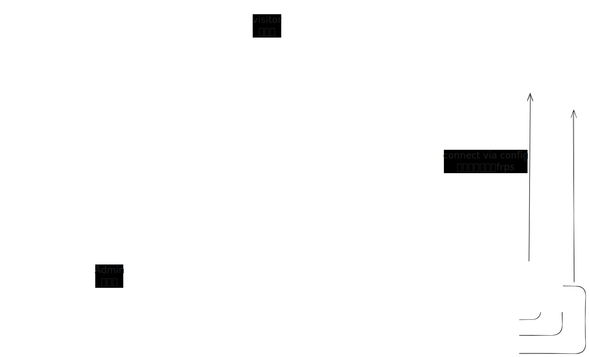

# Quick Start

## Important Pre-Start Reading

`frp-panel` consists of three modules:

1. `master`: The central control module, responsible for distributing configuration files and controlling all other modules
2. `server`: Corresponds to `frps`, responsible for providing traffic entry points
3. `client`: Corresponds to `frpc`, can expose local services to an entry point on the `server`

> When deploying `master`, it will start a default `default server` for `client` connections. Therefore, `master` generally doesn't exist independently, but you can choose not to use it

When deploying, we typically start with the `master`. The `server` and `client` managed by the `master` require automatically generated content from the successfully deployed `master` control page.

For `frp-panel`, we **recommend deploying all components using `docker`** and **using `host` network mode**, unless you need remote terminal control of remote machines, in which case install the service on the client machine.

## Architecture Diagram

