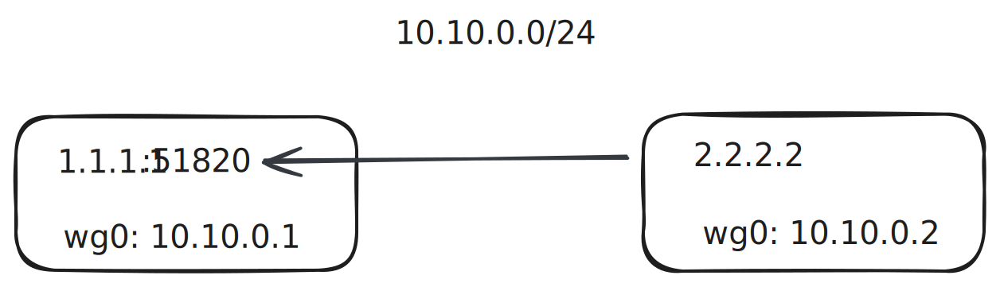

# WireGuard Multi-Hop Smart Networking

- Dev notes: [WireGuard multi-hop smart networking development log](https://vaala.cat/posts/frp-panel-with-wireguard/), includes a funny demo you can try.

> The networking feature is currently in beta (minimum supported version: v0.1.25). Please share feedback via QQ group, GitHub issues, or email.
>
> Networking currently supports Linux hosts only.

`frp-panel` bundles `wireguard-go` to provide networking. It supports WireGuard over UDP/WebSocket multi-hop networking, custom routes and topology, and calculates the shortest path using latency and bandwidth so it works well even in complex network environments.

## Getting Started

### 0. Concepts

Before you begin, make sure all of the following are true:

1. At least one client in the network has a public IP to act as a relay node.
2. All participating machines run Linux.
3. At minimum, `frp-panel master` and `frp-panel client` are installed.
4. `frp-panel client` must be installed with root privileges.

The networking sidebar contains four submenus:

1. **Network**: Clients in the same network can communicate; a client can join multiple networks.
2. **Device**: A client can bind multiple devices. Devices can join networks; devices in the same network can communicate.
3. **Endpoint**: A device can bind multiple endpoints. Endpoints can be connected by other devices. An endpoint is usually a public IP + port.
4. **Connection**: Two devices in the same network can establish a connection if at least one of them has a bound endpoint.

Example:



In the diagram, the two boxes represent two clients sharing the `10.10.0.0/24` network.

Left client:

- Has a **device** `wg0` (virtual NIC) with virtual IP `10.10.0.1`.
- Device `wg0` binds an **endpoint** `10.10.0.1:51820` (public IP + port).
- Device `wg0` joins the **network** `10.10.0.0/24`.
- Device `wg0` can talk to other devices in the `10.10.0.0/24` network.

Right client:

- Has a **device** `wg0` (virtual NIC) with virtual IP `10.10.0.2`.
- Device `wg0` joins the **network** `10.10.0.0/24`.
- Device `wg0` can talk to other devices in the `10.10.0.0/24` network.
- The right client creates a **connection** to the left client via the **endpoint** `1.1.1.1:51820`.

This lets the right client communicate with the left client through `frp-panel` networking.

### 1. Prepare the environment

The networking feature depends on kernel capabilities, so verify the environment first.

If your Linux system has `/etc/sysctl.d`, run:

```bash
echo 'net.ipv4.ip_forward = 1' | sudo tee -a /etc/sysctl.d/99-frp-panel.conf
echo 'net.ipv6.conf.all.forwarding = 1' | sudo tee -a /etc/sysctl.d/99-frp-panel.conf
echo 'net.ipv4.icmp_echo_ignore_all = 1' | sudo tee -a /etc/sysctl.d/99-frp-panel.conf
sudo sysctl -p /etc/sysctl.d/99-frp-panel.conf
```

Otherwise, use `/etc/sysctl.conf`:

```bash
echo 'net.ipv4.ip_forward = 1' | sudo tee -a /etc/sysctl.conf
echo 'net.ipv6.conf.all.forwarding = 1' | sudo tee -a /etc/sysctl.conf
echo 'net.ipv4.icmp_echo_ignore_all = 1' | sudo tee -a /etc/sysctl.conf
sudo sysctl -p /etc/sysctl.conf
```

Next, check whether the TUN device exists. If it does, skip; if not, resolve it first:

```bash
ls /dev/net/tun
```

If the command succeeds, continue.

### 2. Create a network

Open the networking sidebar, select **Network**, then click **New Network**. Fill in the form:

- **Network Name**: Use lowercase English; avoid special characters.
- **CIDR**: The network CIDR, e.g., `10.10.0.0/24`. This example covers `10.10.0.0`–`10.10.0.255`.
- **ACL**: Optional. Controls permissions for **direct connections**. Example:

```json
{
  "acls": [
    { "action": "allow", "src": ["cn"], "dst": ["cn"] },
    { "action": "allow", "src": ["us"], "dst": ["us"] }
  ]
}
```

`action` is `allow` or `deny`. `src` and `dst` are labels (any strings) used to group devices. Labels are assigned when creating devices.

In the example above, devices labeled `cn` can directly connect to `cn`, and `us` to `us`. Others cannot directly connect.

> Manual connections are not governed by ACLs.

Click **Submit** to create the network.

### 3. Create an endpoint (skip for non-public nodes)

Go to **Endpoint** in the networking sidebar and click **New Endpoint**:

- **Client**: Choose a client with public internet access.
- **Host Name**: Public IP or domain, e.g., `1.1.1.1` or `example.com`.
- **Port**: Public-facing port, e.g., `51820`.
- **Type**: `ws` or `udp`. `ws` means WebSocket; `udp` means UDP.
- **URI**: Leave empty for UDP. For WS, provide the full URI, e.g., `ws://example.com:51820`.

Click **Create** when done.

### 4. Create a device

Open **Device** in the networking sidebar and click **Join Network** to add a client to a network:

- **Client**: Select a Linux client installed as root.
- **Network**: Select a known network.
- **Endpoint** (optional for non-public nodes): Select an existing endpoint.
- **Interface Name**: Lowercase letters + digits only, such as `frpp0`. The default value is recommended; invalid names cause startup failures.
- **Local Address**: The device’s virtual IP, e.g., `10.10.0.2`. Must be within the network range. The default value auto-assigns an available IP.
- **Port**: Device port, e.g., `51820`. For public nodes, match the endpoint port; selecting an endpoint will auto-fill it.
- **MTU**: Device MTU, e.g., `1420`. The default is recommended.
- **Labels**: Labels used for **direct connection** permissions. Use English and avoid special characters.

Click **Submit** to create the device.

### 5. Test the network

If everything goes well, your devices should now be networked. In **Network**, pick your network and open the **Topology** tab to view the routing graph.

In theory, if the shortest-path topology shows a route between two nodes (regardless of hops), those nodes can communicate.

Right-click a node in the topology and choose **Open Terminal** to test connectivity.

For example, on the `10.10.0.1` node, run `ping 10.10.0.2`. If it succeeds, networking works.

Click each edge to view detailed routing info.

### 6. Optimize the network (optional)

These settings help nodes pick better links. They do not affect basic functionality.

If things are stable, avoid manual optimization: manual links ignore ACLs, do not adapt to network changes, and incorrect settings can break connectivity. Proceed carefully if you must optimize.

By default, routing is based on latency only, which may be suboptimal.

You can drag from a node’s right black dot to another node’s left black dot to create a connection. When creating manual connections, avoid selecting endpoints to prevent issues when endpoints change.

You can provide actual bandwidth so it factors into shortest-path calculations.

If you need two nodes to always connect directly, you have two options:

1. Configure ACLs so the two nodes can only communicate via direct connections.
2. Create a manual connection between them and set bandwidth to 1000 Mbps so they prefer a direct link.

