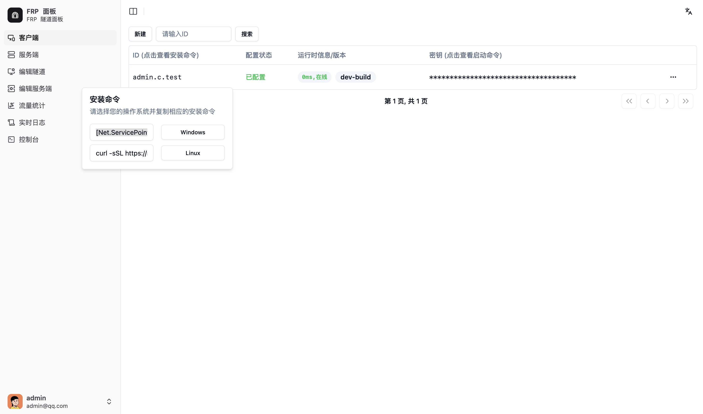

# Client 部署

Client 推荐使用 docker 部署，直接部署在客户机中，可以通过远程终端直接在客户机以 root 权限执行命令，方便升级和管理。

## 准备

打开 Master 的 webui 并登录，如果没有账号，请直接注册，第一个用户即为管理员

在侧边栏跳转到 `服务端`，点击上方的 `新建` 并输入 服务端 的唯一识别ID和 服务端 能够被公网访问的 IP/域名，然后点击保存



刷新后，新的客户端会出现在列表中。

部署client之前，需要修改服务端的配置，否则客户端无法正常连接

## 直接部署

点击对应客户端的 `ID (点击查看安装命令)` 一列，弹出不同系统的安装命令，粘贴到对应终端即可安装，这里以 Linux 为例

```
curl -fSL https://raw.githubusercontent.com/VaalaCat/frp-panel/main/install.sh | bash -s --  client -s abc -i user.s.client1 -a 123123 -r frpp-rpc.example.com -c 9001 -p 9000 -e http
```

如果你在国内，可以增加github加速到安装脚本前

```
curl -fSL https://ghfast.top/https://raw.githubusercontent.com/VaalaCat/frp-panel/main/install.sh | bash -s --  client -s abc -i user.s.client1 -a 123123 -r frpp-rpc.example.com -c 9001 -p 9000 -e http
```

注意，如果你使用 反向代理 TLS，需要修改这行命令类似如下：

```bash
curl -fSL https://ghfast.top/https://raw.githubusercontent.com/VaalaCat/frp-panel/main/install.sh | bash -s --  frp-panel client -s abc -i user.s.client1 -a 123123 -t frpp.example.com -r frpp-rpc.example.com -c 443 -p 443 -e https
```

## Docker Compose 部署

点击对应客户端的 `密钥 (点击查看启动命令)` 一列中的隐藏字段，复制类似的启动命令如下备用：

```bash
frp-panel client -s abc -i user.s.client1 -a 123123 -r frpp-rpc.example.com -c 9001 -p 9000 -e http
```

注意，如果你使用 反向代理 TLS，需要修改这行命令类似如下：

```bash
frp-panel client -s abc -i user.s.client1 -a 123123 -t frpp.example.com -r frpp-rpc.example.com -c 443 -p 443 -e https
```

docker-compose.yaml

```yaml
version: '3'
services:
  frp-panel-client:
    image: vaalacat/frp-panel
    container_name: frp-panel-client
    network_mode: host
    restart: unless-stopped
    command: client -s abc -i user.s.client1 -a 123123 -t frpp.example.com -r frpp-rpc.example.com -c 443 -p 443 -e https
```