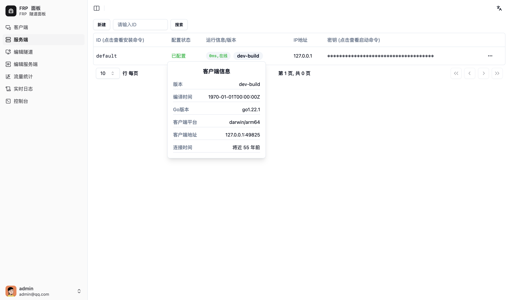

# Server 部署

Server 推荐使用 docker 部署！不推荐直接安装到服务器中

> 如果只有一台公网服务器需要管理，那么使用 `master` 自带的 `default server` 即可，无需单独部署 `server`

## 准备

打开 Master 的 webui 并登录，如果没有账号，请直接注册，第一个用户即为管理员

在侧边栏跳转到 `服务端`，点击上方的 `新建` 并输入 服务端 的唯一识别ID和 服务端 能够被公网访问的 IP/域名，然后点击保存



刷新后，新的服务端会出现在列表中。点击对应服务端的`密钥 (点击查看启动命令)`一列中的隐藏字段，复制类似的启动命令如下备用：

```bash
frp-panel server -s abc -i user.s.server1 -a 123123 -r frpp-rpc.example.com -c 9001 -p 9000 -e http
```

注意，如果你使用 反向代理 TLS，需要修改这行命令类似如下：

```bash
frp-panel server -s abc -i user.s.server1 -a 123123 -t frpp.example.com -r frpp-rpc.example.com -c 443 -p 443 -e https
```

## Docker Compose 部署

docker-compose.yaml

```yaml
version: '3'
services:
  frp-panel-server:
    image: vaalacat/frp-panel
    container_name: frp-panel-server
    network_mode: host
    restart: unless-stopped
    command: server -s abc -i user.s.server1 -a 123123 -t frpp.example.com -r frpp-rpc.example.com -c 443 -p 443 -e https
```

## 直接部署

如果你想要直接部署，请参考 client 部署的步骤